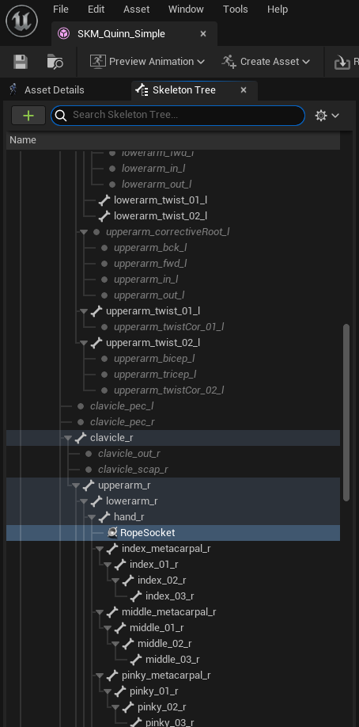

#  Rope Collision
<a href="https://www.youtube.com/watch?v=Esdh_LrxjG4">Preview
<h1> Set up </h1>

 To change rope start position change Rope Socket Location

 You can change rope properties in RopeCollisionandRetraction/Content/ThirdPerson/Blueprints/BP_ThirdPersonCharacter.uasset

